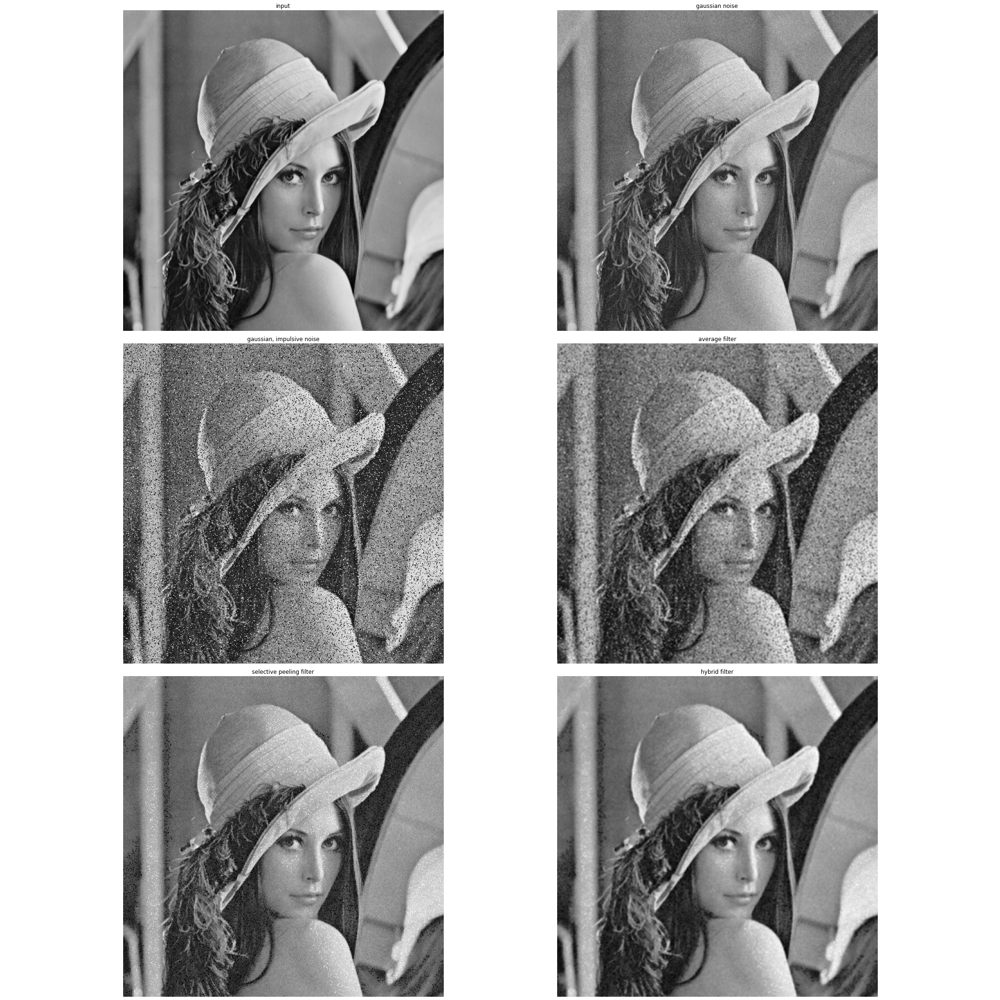

# Hybrid Filter
This is a small project that I create a filter that work with images have a gaussian noise and impulsive noise at the same time
## Test image
the image using is a lena image
## Results
